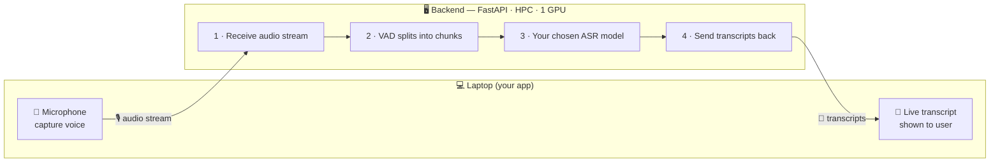

# Real-time Kazakh transcription — build it yourselves (university)

You've picked your call-center ASR model in the homework. Now **deploy it as a live service**:
talk into your laptop → see Kazakh text appear, transcribed by your model running on the GPU.

---

## Architecture

<!-- Renders as a diagram on GitHub / Mermaid-aware viewers: -->

---

## What each side does

**Laptop side (your app)**
- Capture your microphone.
- Stream the audio to the backend.
- Show the transcripts that come back.

**Backend side (FastAPI on the HPC, 1 GPU)**
1. Receive the audio stream.
2. Use a **VAD** to cut the stream into speech chunks (server-side).
3. Run **the ASR model you selected in the homework** on each chunk.
4. Send each transcript back to the laptop.

---

## Your decisions (the accent boxes)

- **The model** — use the one you defended for the call-center scenario.
- **The VAD** — pick one that segments the incoming audio into utterances on the server.

## Deliverable

A working demo: speak into your laptop and watch your model transcribe Kazakh in near-real-time,
plus a short note on which VAD you used and why.

> That's the whole spec — the *how* (audio capture, the streaming protocol, the VAD, the async
> handling on the server) is yours to work out.
